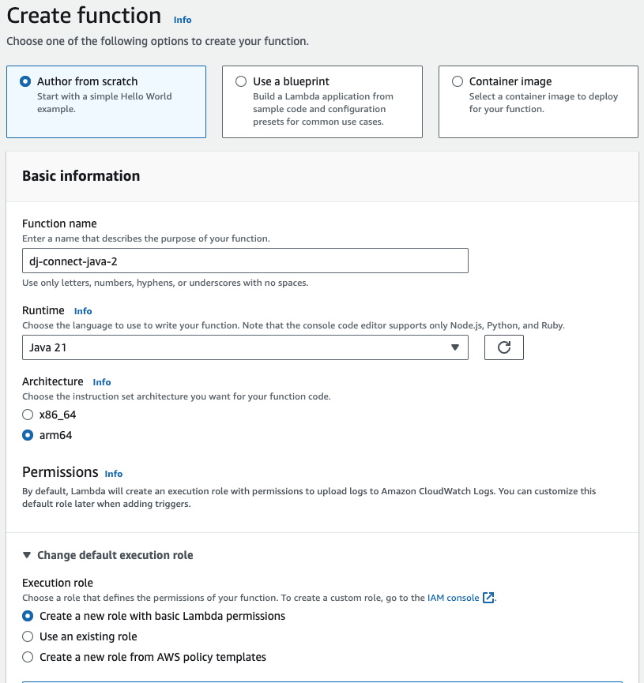
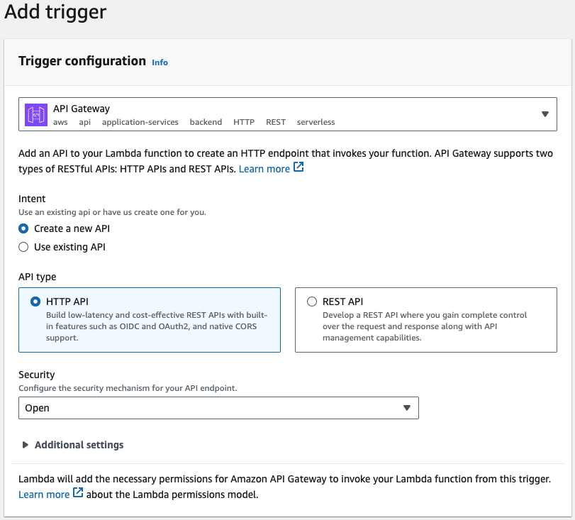
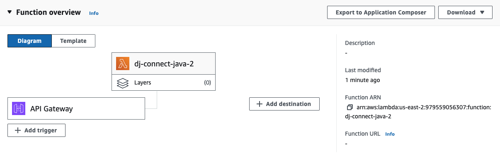

# mongo-iam-connect
Use IAM user and role to connect to MongoDB Atlas

### create Lambda function
- 
- Choose create new role with basic Lambda function OR choose and existing role.
- Copy the ARN from Function ARN  
- Add API Gateway to Trigger the Lambda function
- 
- Final Lambda Setup
- 
- 
### Create IAM Role
- Configure AWS CLI or you dev system using ~/.aws/credentials.
- Edit the assume-role.json policy file to add the Lambda ARN
- aws iam create-role --role-name dj-test-101 --assume-role-policy-document file://assume-role.json

optionally attach policies of relevant AWS services ,
Add IAM role to Atlas 
Create Lambda function . Create a implicit lambda execution role 
optionally attach policies of relevant AWS services , like S# that you want to access via this lambda function
Add trust relationship from Lamda role

### references
- IAM  Role Users , Assume role  :  https://www.youtube.com/watch?v=e8BVM-Hu76w
- Java code to assume  role and secure Temporary token
- Setup AWS SDK Dev environment :
  - How to fetch the temporary keys using JDK , java program
  - https://www.youtube.com/watch?v=JufP7cFYwBk&t=45s
